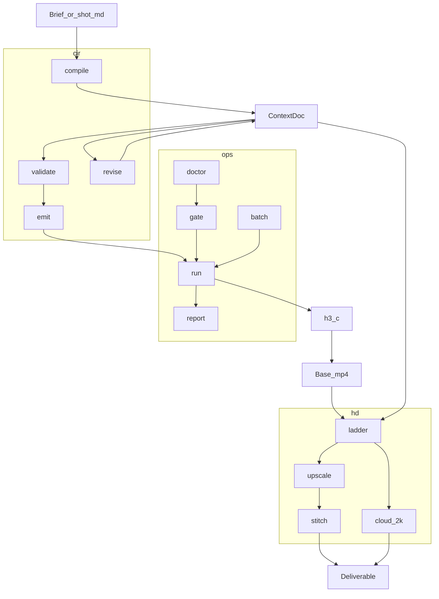

# h3-opt — DESIGN

**Brand:** **h3-opt** — 苹果平台极致性能（repo/CLI still `h3-ops` / `h3ctl`).  
**North star:** Mac Ultra + MiniMax-H3 **秒出** (snap / warm), then climb to deliver.  
**Status:** Phase 0–4 MVP shipped (ops + cir + hd). Phase 5 = cloud adapters + warm session.  
**Engines:** [antirez/h3.c](https://github.com/antirez/h3.c) (Base); optional MiniMax API (cloud CIR / Regenerate-2K).

This file is the architecture SoT. Keep [README.md](README.md) short.

---

## 1. Problem

`h3.c` alone leaves five gaps for a manju / Ultra workflow:

1. **Seconds are possible but not the default** — users burn 5–14 min hero presets while iterating; cold e2e hides a few-second denoise behind TE/load.
2. **No Context-IR** — cloud module is API-only; bare prompts break lock / revise loops.
3. **Ops pain** — wrong cwd (missing `h3_shaders.metal`), `mlx-serve` vs DiT memory fight, jetsam, “hung” jobs that are swapping.
4. **No honest HD** — Regenerate-2K closed; Base ~480–768 class; delivery still needs a labeled ladder.
5. **No continuity product** — FL2VA / Ref2VA flags exist in-engine, but shot handoff (tail→start, looksheet→`--ref-image`) is not a default pipeline → 网剧镜间割裂.

**h3-opt** is Apple-first performance productization of `h3.c`: the **秒出 ladder** (`snap` → `draw` → `preview` → `deliver`), residency rules, and continuity contracts — not a Metal fork.

对外 Necessity reference:** [docs/why-h3-opt.md](docs/why-h3-opt.md)

### Value proposition

| Claim | True? |
|:---|:---|
| Brand = **苹果平台极致性能** | **Yes** — Ultra / Apple Silicon only; no CUDA story |
| Mac Ultra can approach **秒级试片** | **Yes, product goal** — pin `snap` / warm DiT; publish walls |
| We rewrite Metal for free speedups | **No** — antirez/`h3.c` owns kernels; we own the extreme path |
| Every deliver becomes 1s | **No** — hero stays expensive; 秒出 is the iteration tier |
| Drama factory gets faster | **Yes** once it calls `h3ctl` with `PRESET=snap` first |

---

## 2. Principles

1. One hub: `ContextDoc` for `cir` / `ops` / `hd`.
2. Validate before `ops.run` (schema + semantic).
3. Exclusive GPU: CIR LLM ∥ Base DiT never; GPU upscalers wait for Base.
4. Spawn `chdir` to h3.c tree (shaders).
5. Honest HD labels: `native` | `upscale_*` | `cloud_2k`.
6. No weights in-repo.
7. Drama / manju-factory stay outside; they call `h3ctl` (see factory `scripts/h3c_from_shot.py`).
8. Factory hard rule on large Macs: prefer `--no-ssd-streaming` (memory-resident DiT) for snap/warm.
9. **秒出 before deliver** — default iteration preset is `snap` / `snap256`; never open with `deliver`.

---

## 3. Architecture



| Process | Parallel with Base? |
|:---|:---|
| CIR LLM | **No** |
| `h3` DiT | exclusive (holds lock) |
| GPU upscaler | **No** |
| CPU ffmpeg scale / stitch | OK after Base exits |
| Cloud 2K | remote; OK |

---

## 4. ContextDoc

- Schema: [docs/schemas/context_doc.v1.json](docs/schemas/context_doc.v1.json)
- Example: [examples/leafcut.cir.json](examples/leafcut.cir.json)
- `schema_version`: `"context_doc.v1"`

### 4.1 Fields

| Field | Role |
|:---|:---|
| `id` / `title` | stable id + human title |
| `brief` | intent (zh OK) |
| `locks` | character, wardrobe, weapon, palette, camera |
| `beats[]` | ordered actions; optional `t0`/`t1` seconds |
| `negatives` | hard bans |
| `canvas` | `{w,h}` multiple of 16 |
| `duration` / `fps` | seconds; fps default 24 → frames |
| `style_anchor` | short style line |
| `seed` | optional; CLI may override |
| `emit_profile` | `h3c_plain` \| `h3c_dense` |
| `hd_intent` | see §7 |
| `unsafe` | allow non-allowlist canvas (still needs gate) |
| `revise_log[]` | append-only |

### 4.2 Canvas allowlist

| Class | Sizes | Gate |
|:---|:---|:---|
| safe | `512×512`, `480×832`, `832×480` | normal |
| caution | `576×1024`, `1024×576` | doctor green + free-pages warn |
| unsafe | anything else ≤2048, ÷16 | `unsafe:true` **and** `--i-know` |

Reject native “720p fantasy” without `unsafe`.

### 4.3 Semantic validate

1. If beat has both `t0` and `t1` → `t0 ≤ t1`.
2. Along beats with `t1` set, `t1` non-decreasing.
3. `duration ≥` last `t1` when present.
4. `frames = round(duration * fps)` must be ≥ 22 when used (h3.c practical floor); preset may clamp.
5. `emit_profile=h3c_dense` → `locks.character` and `locks.camera` non-empty (schema already).
6. No string in `negatives` identical to any lock string.
7. `canvas` ∈ allowlist unless `unsafe`.

`ops.run` uses the same validator. Soft mode: `cir.compile --draft` only.

### 4.4 Emit → prompt file

Deterministic serialization (no new story):

```text
[style] {style_anchor}
[canvas] {w}x{h} ~{duration}s @{fps}fps
[locks]
character: ...
wardrobe: ...
...
[beats]
1. (t0-t1) action
...
[negatives]
- ...
[must_fix]   # from revise_log, if any
- ...
```

- `h3c_plain`: style + beats + negatives  
- `h3c_dense`: full locks + beats (default preview+)

---

## 5. cir

| Command | In → Out |
|:---|:---|
| `compile` | brief / shot.md → ContextDoc |
| `validate` | doc → exit 0/1 + errors |
| `revise` | doc + notes → doc (`locks` frozen unless `--unlock`) |
| `emit` | doc → `.prompt.txt` |

**Backends:** (1) template offline default → (2) local LLM → (3) optional cloud CIR.  
v0.1 = template + validate. LLM = Phase 3.

Revise always appends `{ts, notes, backend}` to `revise_log`.

---

## 6. ops

### 6.1 Commands

| Cmd | Job |
|:---|:---|
| `doctor` | arch, metal, binary, shaders, `FL2VA`, free pages, competing ports/PIDs |
| `gate` | red doctor → refuse; `unsafe_hq` / unsafe canvas → need `--i-know` |
| `run` | validate? → emit? → lock → spawn → report |
| `batch` | serial queue only |
| `report` | print / dump last job JSON |

Phase 1 `run` accepts `--prompt-file` without ContextDoc. Phase 2+ prefers `--doc`.

### 6.2 Spawn contract (non-negotiable)

```text
chdir($H3_OPS_H3C_SRC)          # h3_shaders.metal must resolve
argv: ./h3 --model $H3_OPS_MODEL_DIR --prompt-file P
      --width W --height H --frames F --steps S [--seed N]
      --ssd-streaming           # default ON if RAM ≥ 64GB
      [extra from preset]
stdout/err → <out_stem>.log
lock → $H3_OPS_LOCK  (PID, started_at, argv_hash)
```

Live PID holds lock → fail with holder info. Dead PID → steal + warn.

### 6.3 Presets

| id | w×h | frames | steps | notes |
|:---|:---|:---:|:---:|:---|
| smoke | 512×512 | 22 | 4 | path check |
| draw | 480×832 | 56 | 4–8 | vertical cards |
| preview | 480×832 | 124 | 8 | ≥5s |
| deliver | 480×832 | 124 | 20–30 | gate green |
| unsafe_hq | ≥576×1024 | 124 | ≥20 | `--i-know` |

`--frames` from doc: `round(duration * fps)` when `--from-duration`, else preset default.

### 6.4 Doctor (minimum)

1. `uname -m` == `arm64`
2. `$H3_OPS_H3C_SRC/h3` executable + `h3_shaders.metal`
3. `$H3_OPS_MODEL_DIR/FL2VA/` present
4. Free pages ≥ warn threshold (default ~2GB); below → yellow/red
5. No listeners on configured mlx-serve ports
6. No other `h3` / known DiT unless `--force`

### 6.5 Report JSON

```json
{
  "job_id": "…",
  "doc_id": null,
  "preset": "preview",
  "argv": ["…"],
  "cwd": "/path/to/h3.c",
  "started_at": "ISO-8601",
  "ended_at": "ISO-8601",
  "exit_code": 0,
  "wall_s": 300.1,
  "output_mp4": "…",
  "log_path": "…",
  "warnings": []
}
```

---

## 7. hd

| Level | Name | Method | Claim |
|:---|:---|:---|:---|
| L0 | `native` | Base as-is | native H3 |
| L1 | `upscale_1080` | RealESRGAN / ffmpeg | **upscale** |
| L2 | `upscale_2k` | stronger local | **upscale** |
| L3 | `cloud_2k` | MiniMax API | cloud regenerate |

Sidecar `*.hd.json` records `level_requested` / `level_achieved` / `claims`.  
Never label L1/L2 as Regenerate-2K.

Commands: `hd ladder` | `hd deliver` | `hd stitch`.

---

## 8. Config

| Env | Purpose |
|:---|:---|
| `H3_OPS_H3C_SRC` | h3.c checkout (cwd + binary) |
| `H3_OPS_MODEL_DIR` | MiniMax-H3 root |
| `H3_OPS_LOCK` | default `~/.cache/h3-ops/gpu.lock` |
| `H3_OPS_LLM_BASE` / `H3_OPS_LLM_MODEL` | cir LLM |
| `MINIMAX_API_KEY` | cloud adapters |

Optional `~/.config/h3-ops/config.toml` overrides env (Phase 1.1).

---

## 9. Factory integration

AI漫剧工厂 stays the drama OS. It should:

- feed briefs → `cir.compile`
- replace ad-hoc h3.c shells with `h3ctl run`
- write `-o` under project `renders/` / `logs/`
- **not** start mlx-serve while the GPU lock is held

Historical drafts (pointers only): factory `docs/h3-ops-companion-design.md`, `docs/h3-cir-hd-design.md`.

---

## 10. Phases

### Phase 0 — docs ✅

README, DESIGN, LICENSE, schema, `.gitignore`, `git init`, example ContextDoc, preset YAML stubs.

### Phase 1 — ops MVP ✅

**Shipped:**

- `src/h3_ops/ops/{doctor,gate,lock,run,report}.py`
- `presets/*.yaml`
- `scripts/h3ctl` → `python -m h3_ops`
- `--prompt-file` path (no CIR yet)

**Done when (verified on M3 Ultra 2026-09-12):**

1. `h3ctl doctor` reports arch/bin/shaders/FL2VA; RED when rival `./h3` alive; YELLOW for mlx ports incl. 11236.
2. `h3ctl run --preset smoke` → `out/smoke.mp4` 512² · wall **66.5s** · exit 0 + `.report.json`.
3. Second acquire while lock held → `LockError`; `h3ctl lock release` force-clears.
4. Spawn always `cwd=H3_OPS_H3C_SRC` (`./h3` + `--ssd-streaming`).

### Phase 2 — cir MVP ✅

Schema validate + template `compile` + `emit`; `run --doc` (+ `--from-duration`).

**Verified:** `cir validate` leafcut OK; `emit` 320 chars; `compile` brief→doc; `run --doc --dry-run` uses canvas 480×832 frames=125; unsafe 720p rejected.

### Phase 3 — cir LLM + revise ✅

OpenAI-compatible compile/revise; lock freeze unless `--unlock`.

**Verified:** template revise freezes locks + `revise_log` / `[must_fix]`; `--unlock character` mutates only that group; LLM revise via `H3_OPS_LLM_BASE=http://127.0.0.1:11236/v1` kept locks identical (~2 min).

### Phase 4 — hd MVP ✅

L0/L1/L2 local deliver + sidecar; stitch. L3 cloud deferred to Phase 5.

**Verified:** `hd deliver --target upscale_1080` 512→1080 with claims `upscale` + `not_cloud_regenerate_2k`; `hd stitch` concat OK.

### Phase 5 — cloud adapters

Optional CIR + Regenerate-2K.

---

## 11. Acceptance (coding-ready)

1. Phase 1 scope is unambiguous from §10.
2. [examples/leafcut.cir.json](examples/leafcut.cir.json) matches schema.
3. Every `run` PR keeps: chdir + ssd default + exclusive lock.
4. HD copy never claims cloud regenerate for local upscale.

---

## 12. Risks

| Risk | Mitigation |
|:---|:---|
| Local CIR ≠ cloud quality | template + revise; optional cloud later |
| jetsam on unsafe_hq | doctor free-pages + gate |
| long job looks dead | log heartbeat / tail in Phase 1.1 |
| schema churn | `schema_version` + migrate note |

---

## 13. References

- [Why h3-opt（必要性）](docs/why-h3-opt.md)
- antirez/h3.c README (cwd, streaming, limits; FL2VA / Ref2VA)
- MiniMax-H3 / FL2VA layout
- Factory field runs: jiangye h3c-compare (smoke → dazhao s30)
